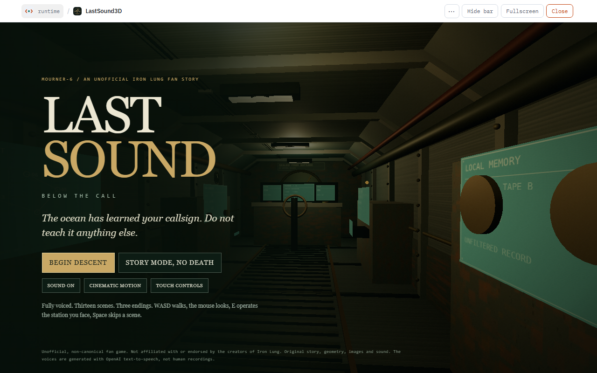
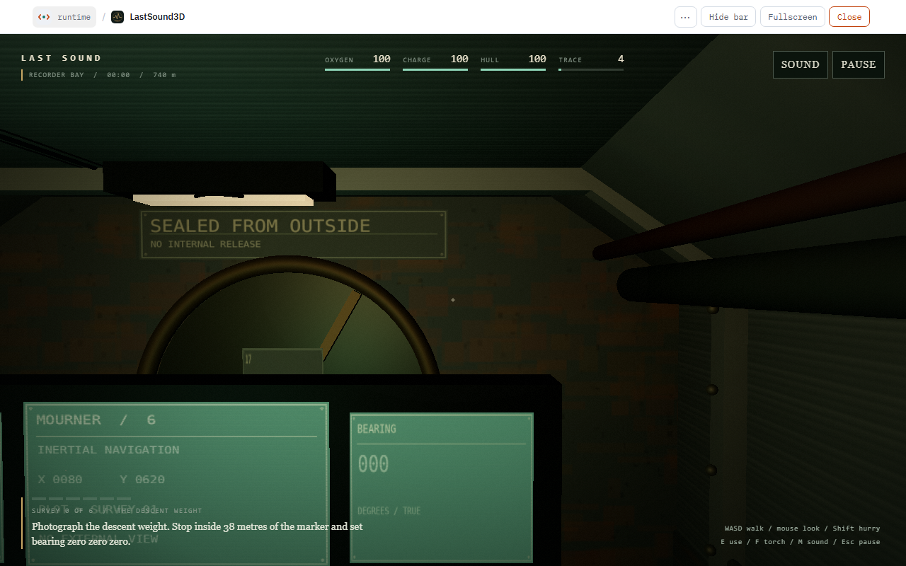
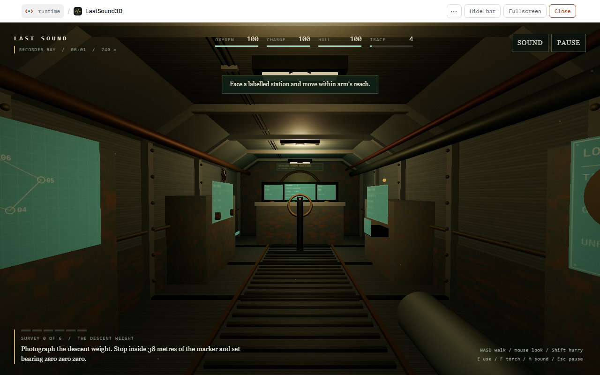
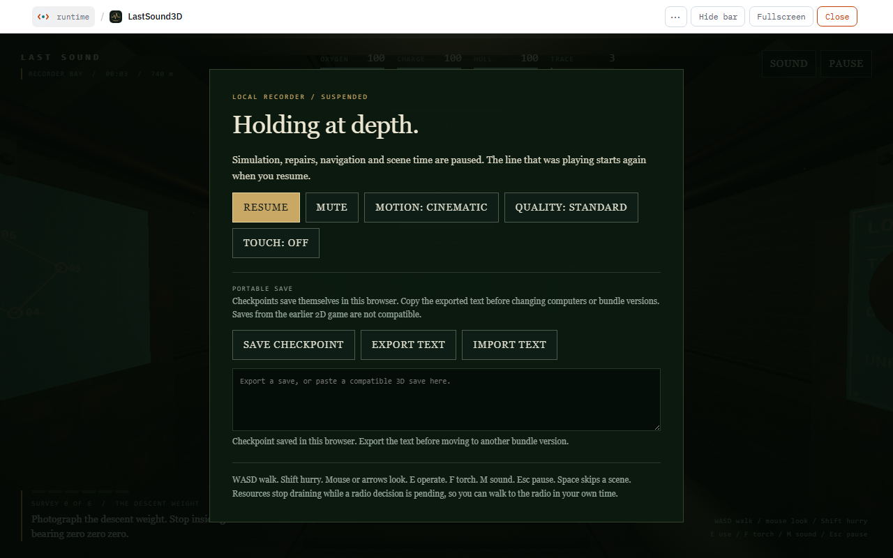

# LAST SOUND: Below the Call

*MOURNER-6 / an unofficial Iron Lung fan story.* A fully voiced first-person survey of a blood ocean from inside a sealed pressure hull, built for [SoftN](https://softn.com). You are Operator 17, winched into the Lacuna Trench in a capsule with no window. Walk its three compartments, keep it breathing, photograph six things that should not be there, and decide which record leaves the trench.

> The ocean has learned your callsign. Do not teach it anything else.



## The game

- **Three walkable compartments** in real 3D: the control room (helm, exposure printer, radio, chart), the recorder bay, and engineering aft (AUX bus, scrubber bypass, bilge pump, pressure seam, service cartridges, the beacon cutter, and a hatch sealed from the outside).
- **A six-photograph survey.** Controller Vale plots each target; you steer the capsule from the helm, stop within 38 metres, turn to the ordered bearing and expose a frame. A frame taken while moving is rejected. The six required records are the descent weight, the lattice arch, the relay mast, the choir of apertures, a second capsule that looks exactly like yours, and the listening well. An earlier capsule's wreck is optional, and its recorder can be recovered by the arm.
- **Life support that has to be kept alive.** Oxygen, charge and hull are always draining or at risk. The scrubber fails and must be repaired in a four-step order at the starboard box, the port valve and the contactor; a leak means stop, seal the seam, then pump the bilge; reserve cells and oxygen canisters buy time. Every sonar ping and decoy raises the trace of whatever is listening.
- **A radio with three frequencies.** Operations, the maintenance archive on 74.6, and the open carrier on 83.5. Something answers on the carrier that is not using the same record you are.
- **Three endings, chosen at the radio once all six records are in.** *Asset Recovered* (the approved packet), *A Record, Not a Promise* (a warning, which needs the maintenance archive and at least three pieces of evidence), and *No Return Requested* (a silent ascent, which is done by hand in the aft compartment). Hull failure, life support and the main bus each have their own ending and a checkpoint to return from.
- **Fully voiced.** 181 lines across 13 cinematic scenes and the running commentary: Controller Vale, the earlier operator Sen on the recovered tapes, the printer, the system voice, the recovery arm, the maintenance archive, and the thing that answers. Every line is captioned.

## Controls

| Input | Action |
| --- | --- |
| `W` `A` `S` `D` or arrows | Walk |
| `Shift` | Hurry |
| Mouse (click to capture) or arrows | Look |
| `E` | Operate the station you are facing |
| `F` | Torch |
| `M` | Sound on / off |
| `Esc` | Pause, or close the open station |
| `Space` | Skip a scene |
| `1` `2` `3` | Choose a radio option |

Touch controls can be switched on from the title screen or the pause menu. Resources stop draining while a radio decision is pending, so you can walk to the radio in your own time.



## Playing it

- **Begin descent** is the standard game. **Story mode, no death** floors hull, oxygen and charge at 25 and slows their drain to a third, so the survey can be finished without the repairs becoming the game.
- **Checkpoints** save themselves in the browser. The pause menu can also export a checkpoint as text and import one, which is how a game moves between computers or bundle versions.
- **Cinematic motion** can be reduced from the title screen or pause menu; **Quality** has a lighter setting for slower machines.
- The HUD shows the compartment you are in, elapsed time, depth, oxygen, charge, hull and trace, the current survey order, and the keys.





## Play it in SoftN

- Download `LastSound3D.softn` from the latest [release](../../releases) and open it in the SoftN web runtime with its file picker, or serve the file and open the runtime with `?open=<url of the bundle>`.
- Or play it inside a softn.com checkout, which also lists it in the directory:

```sh
npm run install-into -- "C:\path\to\softn.com"      # add --dry-run first if you like
cd "C:\path\to\softn.com" && npm run dev:web        # then http://localhost:1420/?open=/demos/LastSound3D.softn
npm run uninstall-from -- "C:\path\to\softn.com"    # removes it again
```

The installer copies `bundle/` to `apps/demo/bundles/LastSound3D`, makes sure the demo catalogue lists the game, and rebuilds with the checkout's own builder. It never commits, pushes or deploys.

## Build

```sh
npm ci
npm test          # static checks: manifest, assets, handlers, voice manifest, media, size
npm run build     # dist/LastSound3D.softn, dist/SHA256SUMS.txt, dist/RELEASE_NOTES.md
npm run validate  # the structural check the SoftN loaders apply
```

Node 20.19 or newer. The build is byte-for-byte reproducible from the sources (entries are stored, not compressed, in a sorted order) and matches what softn.com's own `build-bundle.cjs` produces; it refuses a bundle over the runtime's 32 MB remote limit.

## Release

1. Bump `version` in `bundle/manifest.json` (and `permission.json`) and commit.
2. Tag and push: `git tag v0.3.1 && git push origin v0.3.1`.

The `Release` workflow runs the checks, builds, validates, refuses a tag that doesn't match the manifest version, and publishes `LastSound3D.softn` and `SHA256SUMS.txt` as a GitHub Release. The `Build` workflow does the same checks on every push and keeps the bundle as a workflow artifact.

## Layout

| Path | What it is |
| --- | --- |
| `bundle/` | The game: `manifest.json`, `permission.json`, `ui/main.ui`, `logic/main.logic`, and `assets/` (181 voice clips, 20 sound effects, survey photographs, decals, chart and icon). |
| `tools/` | The packer, source composer, bundle validator and sound synthesizer copied from softn.com, so the game builds without the engine checkout. |
| `scripts/` | `check.cjs` (static checks), `build.cjs`, `install-into-softn.cjs`, `uninstall-from-softn.cjs`. |
| `site/` | The directory thumbnail and the catalogue entry the installer restores. |
| `screenshots/` | The images above, taken in the SoftN web runtime. |

## How it is made

The whole game is one `.ui` file and one `.logic` file. The 3D interior is SoftN's `Scene3D` with instanced geometry; the simulation, the survey, the scenes and the voice cues are plain JavaScript run by the ZIPP engine, with content kept as data so the campaign can be extended without touching the loop. Voice lines are keyed by speaker and text and listed in the logic's voice manifest with their durations, so a scene's timing follows its audio. The voices were generated with OpenAI text-to-speech and treated per character with ffmpeg; they are not human recordings. Geometry, images and sound are original.

## Credits and notice

An unofficial, non-canonical fan story. Not affiliated with or endorsed by the creators of Iron Lung. Original story, geometry, images and sound; see `NOTICE.md`. Source under the Apache License 2.0.
